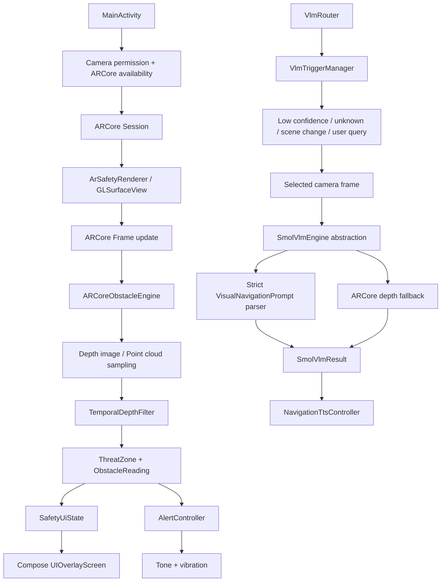

# Spatial Safety AR — Architecture aur Implementation Report

**Repository:** `jay-123-oss/spatial-safety-ar`  
**Branch:** `test-1`  
**Latest rebuild commit:** `702efd6 — Rebuild runtime ownership and verify Android pipeline`  
**Report language:** Hindi/Hinglish  
**Prepared by:** Manus AI  
**Status date:** 18 August 2026

## 1. Executive summary

Current project mein **package-based layered Android architecture** follow ki gayi hai. Yeh abhi separate Gradle multi-module Clean Architecture nahi hai; poora native Android implementation ek `:app` module ke andar packages ke through organize hai. Runtime design ka main principle yeh hai ki **ARCore aur Safety Engine immediate safety ke liye authoritative rahenge**, jabki VLM ko secondary cognition layer maana gaya hai.

> **Important distinction:** Code architecture ka intended design kaafi clear hai, lekin kuch components repository mein implemented hone ke bawajood current `MainActivity` runtime path mein active nahi hain. Specifically, generic YOLO/TFLite pipeline instantiate nahi ho rahi, aur SmolVLM2 ka real local model/runtime artifact package nahi hai. Isliye current APK ko “complete working YOLO + on-device VLM app” kehna technically correct nahi hoga.

Current verified runtime ka strongest part **ARCore camera session, depth/point-cloud obstacle analysis, temporal filtering, safety-zone classification, tone/vibration feedback, Compose HUD, lifecycle handling, and fail-safe behavior** hai. VLM ke liye abstraction, router, parser, fallback aur tests maujood hain, lekin actual model inference aur frame-to-VLM binding abhi complete nahi hai.

## 2. Kaunsa architecture follow kiya gaya hai?

### 2.1 Architecture style

Project ne practical form mein **layered hybrid architecture** follow kiya hai:

| Layer | Package/file area | Responsibility |
|---|---|---|
| Presentation layer | `ui/UIOverlayScreen.kt`, Compose code in `MainActivity.kt` | Safety status, obstacle distance, confidence, source, FPS/CPU/battery aur error state render karna |
| Application/orchestration layer | `MainActivity.kt`, `SmolVlmPipeline.kt`, `VlmRouting.kt` | Lifecycle, AR session startup, permission flow, VLM trigger decision, resource cleanup |
| Perception layer | `ar/ArSafetyRenderer.kt`, `safety/ARCoreObstacleEngine.kt`, `pipeline/TrinetraPipeline.kt` | Camera/ARCore frame, depth image, point cloud, TFLite detection, tracking aur spatial fusion |
| Domain/safety layer | `safety/SafetyModels.kt`, `ARCoreObstacleEngine.kt`, `TrinetraPipeline.kt` | Threat zones, distance, confidence, temporal stability, collision risk aur alert decision |
| VLM cognition layer | `pipeline/VisionLanguageModel.kt`, `VlmRouting.kt`, `VisualNavigationPrompt.kt`, `SmolVlmPipeline.kt` | Model abstraction, trigger policy, strict JSON parser, model fallback aur contextual description |
| Feedback layer | `safety/AlertController.kt`, `safety/NavigationTtsController.kt` | Safety tone/vibration aur VLM contextual TTS ko separate rakhna |
| Infrastructure layer | Gradle, ARCore, CameraX, TensorFlow Lite, coroutines | Android build, camera/AR runtime, inference runtime aur asynchronous execution |
| Test layer | `app/src/test/...` | Parser, router, mock responses, fallback, depth safety aur model lifecycle tests |

Yeh architecture **single Android app module + package-level separation** hai. Iska benefit simple build aur fast iteration hai. Iski limitation yeh hai ki presentation, orchestration, perception aur domain boundaries compile-time modules ke roop mein enforced nahi hoti.

### 2.2 High-level runtime design



### 2.3 Safety authority principle

Safety priority intentionally is:

1. **ARCore/Depth + Safety Engine:** immediate obstacle distance, zone classification aur emergency feedback.
2. **YOLO/Tracking/Spatial Fusion:** object-level perception, jab trained detector asset available ho.
3. **VLM:** uncertain object, scene understanding, unusual relation, user query aur contextual description.
4. **TTS:** VLM ka concise description; immediate safety alert ka ownership `AlertController` ke paas.

VLM ko emergency braking, collision decision, ya Safety Engine override karne ki permission nahi di gayi. Yeh separation `VisualNavigationPrompt.SYSTEM_PROMPT`, `VlmTriggerManager`, aur separate alert/TTS classes mein encoded hai.

## 3. Runtime mein step-by-step kya hota hai?

### 3.1 Application startup

`MainActivity` `ComponentActivity` se derive hoti hai aur startup ke waqt:

1. Edge-to-edge Compose UI initialize karti hai.
2. `AlertController` create karti hai.
3. VLM pipeline ka local boundary create karti hai.
4. Camera permission request karti hai.
5. ARCore availability check karti hai.
6. Zaroorat padne par ARCore installation request karti hai.
7. `ArSafetyRenderer` aur `GLSurfaceView` initialize karti hai.
8. `Session` create karke depth mode support hone par `Config.DepthMode.AUTOMATIC` enable karti hai.
9. `Session.resume()` aur renderer resume karti hai.
10. `onPause()` / `onDestroy()` mein renderer, AR session, VLM pipeline, TTS aur alert resources release karti hai.

Old device log mein `com.manus.spatialsafety.MainActivity` missing hone ki wajah se launch crash tha. Iske liye current launcher `com.manus.spatialsafety.ar.MainActivity` hai aur stale explicit intents ke liye compatibility activity register ki gayi hai.

### 3.2 ARCore frame aur safety path

`ArSafetyRenderer.onDrawFrame()` active ARCore session se frame update karta hai. Tracking state valid hone par `ARCoreObstacleEngine.analyze(frame)` call hota hai. Engine:

- pehle central point-cloud sampling try karta hai;
- unavailable hone par depth image sampling try karta hai;
- center-weighted grid ya central point cloud se multiple readings leta hai;
- invalid, out-of-range, ya low-confidence samples reject karta hai;
- weighted median/robust quantile se distance nikalta hai;
- `TemporalDepthFilter` se near obstacle ko fast respond aur receding reading ko stable smooth karta hai;
- 20 FPS maximum analysis budget use karta hai;
- `ObstacleReading` create karta hai jisme distance, source, confidence, sample count aur stability hoti hai;
- distance ko `SURAKSHIT`, `CHETAAVNI`, `SAVDHAAN`, ya `TURANT_RUKE` zone mein classify karta hai.

Current threshold logic roughly is tarah hai:

| Distance | Threat zone |
|---:|---|
| `> 4.0 m` | `SURAKSHIT` |
| `2.5–4.0 m` | `CHETAAVNI` |
| `1.0–2.5 m` | `SAVDHAAN` |
| `< 1.0 m` | `TURANT_RUKE` |

Actual feedback `AlertController` ke through tone/vibration hai. Is controller mein rate limiting, emergency vibration lifecycle, unknown/tracking loss reset, aur API 24-compatible vibration handling hai.

### 3.3 UI path

`ArSafetyRenderer` callback ke through `SafetyUiState` update hota hai. Compose `UIOverlayScreen` is state ko teen primary cards mein show karta hai:

- current threat zone aur tracking state;
- closest obstacle distance, source, confidence aur stability;
- FPS, battery, CPU aur GPU text placeholder.

ARCore exception, unavailable camera, unsupported device, permission denial, ya startup failure ko process crash ke bajay visible UI error state mein convert kiya gaya hai.

## 4. YOLO, tracking aur spatial fusion implementation

`TrinetraPipeline.kt` mein generic object-perception stack implemented hai:

| Component | Implementation |
|---|---|
| CameraX controller | `TrinetraCameraController` with `KEEP_ONLY_LATEST` strategy |
| Image analyzer | `TrinetraImageAnalyzer` |
| Object detector | `YoloTflite` using TensorFlow Lite `Interpreter` |
| Quantization support | FLOAT32, UINT8 aur INT8 tensor handling |
| Delegate | NNAPI first, GPU fallback, XNNPACK/thread fallback |
| Preprocessing | Letterbox resize, RGB packing, source-coordinate remapping |
| Postprocessing | YOLO output decode, confidence validation, class mapping, NMS |
| Tracking interface | `ByteTrackAdapter` |
| 3D fusion | `SpatialFusion` with robust depth sampling and camera intrinsics |
| Motion/risk | `WorldModel` + `CollisionPredictor` |
| Safety state | `SafetyEngine` with `StateFlow<RiskState>` |

### Critical active-runtime status

Yeh stack source code mein implemented hai, lekin current `MainActivity` is stack ko instantiate nahi karti. Repository mein trained YOLO `.tflite` model aur label asset bhi nahi hai. Isliye **YOLO code compile/test level par present hai, par current installed app ka verified active perception path ARCore obstacle engine hai**. Real-scene accuracy claim ke liye trained model, labels, camera calibration aur device evaluation mandatory hain.

## 5. VLM architecture aur current implementation

### 5.1 Abstraction

`VisionLanguageModel` interface model ko lifecycle boundary deta hai:

```text
initialize() -> analyze(imageBytes, context) -> release()
```

States:

`IDLE`, `LOADING`, `READY`, `PROCESSING`, `COOLDOWN`, `ERROR`, `DISABLED`.

`SmolVlmEngine` runtime initialization ko one-time guard karta hai, processing failure par safe fallback deta hai, aur `release()` par runtime resources release karta hai. Future model replacement ke liye same interface Moondream, PaliGemma, Qwen ya kisi aur local engine ke saath reuse ho sakta hai.

### 5.2 Trigger policy

`PerceptionContext` mein YOLO confidence, unknown object, detection instability, scene change, overlapping objects, safety-critical state, depth distance aur user query pass ki ja sakti hai.

`VlmTriggerManager` ke default rules:

| Condition | VLM behavior |
|---|---|
| Normal high-confidence scene | VLM OFF |
| YOLO confidence `< 0.55` | VLM ON |
| Unknown/unstable object do repeated frames tak | VLM ON |
| Scene change | VLM ON |
| Overlapping/complex objects | VLM ON |
| User query | VLM ON |
| Safety-critical state | VLM bypass; safety engine immediately authoritative |

`VlmRouter` duplicate request queue nahi banata. Ek time par single-flight request allow hoti hai aur default cooldown `1.2 seconds` hai.

### 5.3 Frame processing design

`SmolVlmCameraAnalyzer` ka intended behavior:

1. Trigger policy check karta hai.
2. Latest selected frame hi process karta hai.
3. Minimum frame interval `1.2 seconds` rakhta hai.
4. Active request hone par new request drop karta hai.
5. YUV frame ko bitmap mein convert karta hai.
6. JPEG quality `65` aur maximum edge `768 px` use karta hai.
7. Coroutine IO dispatcher par inference run karta hai.
8. Result TTS callback ko deta hai.

### 5.4 Strict structured parser

`VisualNavigationPrompt.parse()` exactly in six keys ko accept karta hai:

```json
{
  "path_status": "clear|partially_blocked|blocked|uncertain",
  "hazard": "none|obstacle|pothole|stairs|vehicle|person|wall|unknown",
  "position": "left|center|right|unknown",
  "description": "short safety-relevant description",
  "confidence": 0.0,
  "uncertainty": "low|medium|high"
}
```

Parser:

- malformed JSON reject karta hai;
- missing ya extra top-level key par fallback deta hai;
- extra top-level fields reject karta hai;
- confidence ko `0..1` validate karta hai;
- hazard aur position vocabulary validate karta hai;
- path status aur uncertainty enum validate karta hai;
- description ko non-empty aur maximum two sentences enforce karta hai;
- invalid result par `SAFE_FALLBACK` return karta hai.

### 5.5 TTS behavior

`NavigationTtsController` validated `SmolVlmResult.description` ko hi speak karta hai. Hazard metadata, confidence, uncertainty, aur raw model response voice mein nahi jaate. TTS initialization main thread par hoti hai, locale availability check hota hai, aur `QUEUE_FLUSH` latest contextual message ko priority deta hai.

### 5.6 VLM ka actual current status

Current code mein `SmolVlmNavigationPipeline` local engine boundary banata hai aur `ArtifactGatedLocalVlmRuntime` use karta hai. Is runtime ka `initialize()` false return karta hai jab official `.litertlm` artifact/runtime package mein nahi hota. Isliye real SmolVLM2 model inference abhi execute nahi hoti; safe fallback return hota hai.

Saath hi, duplicate CameraX binding remove karke ARCore ko single camera owner banaya gaya hai. Current ARCore renderer selected frame ko `SmolVlmCameraAnalyzer` tak pass karta hai. Actual inference phir bhi artifact-gated hai jab tak official local model/runtime package nahi hota.

## 6. Fallback behavior

VLM unavailable, malformed output, processing error, ya model artifact missing hone par app crash nahi karta.

ARCore depth fallback:

| Condition | Fallback result |
|---|---|
| `distance <= 0.8 m` | Blocked path, front obstacle context |
| `0.8–1.5 m` | Partially blocked path, caution context |
| `> 1.5 m` | Immediate path clear by depth context |
| Depth unavailable | High-uncertainty conservative fallback |

Safety warning ka source VLM fallback nahi, balki `AlertController` aur ARCore Safety Engine hi rehte hain.

## 7. Performance optimization

Current implementation mein following optimizations ki gayi hain:

| Area | Optimization |
|---|---|
| ARCore depth | 50 ms analysis interval, approximately 20 FPS maximum |
| Point cloud | Device-specific depth-image native errors se bachne ke liye point cloud first |
| CameraX | `KEEP_ONLY_LATEST` backpressure strategy in generic CameraX controller |
| YOLO | Single-thread inference, mutex guard, 10 FPS cap, NMS and tensor validation |
| VLM frame | 1.2 second interval, active-request drop, JPEG quality 65, edge 768 px |
| VLM output | Maximum 160 tokens profile-level hint |
| Memory | Bitmap recycle, analyzer close, AR session close, TTS shutdown |
| Logs | Error logging throttling aur explicit VLM lifecycle/request diagnostics |
| UI | State updates approximately 100 ms se zyada frequent nahi |

### Performance limitation

Ye settings latency/memory ke liye reasonable engineering defaults hain, lekin actual FPS, inference latency, thermal behavior aur accuracy real Android device par measure nahi kiye gaye kyunki sandbox mein connected device/emulator available nahi tha.

## 8. Testing aur verification

### 8.1 Unit-test coverage

| Test area | Coverage |
|---|---|
| Structured parser | Valid JSON, malformed JSON, missing field, extra field, invalid position/confidence, low-light uncertainty |
| VLM router | Normal OFF, low confidence ON, user query ON, safety-critical bypass, cooldown, single-flight |
| Latency fallback | Fast online result, slow/timeout result, depth fallback, unavailable depth |
| Mock VLM | Hazard, clear path, low-light, sudden obstacle, malformed response, TTS description |
| ARCore safety | Depth sampling, robust filtering, NaN/invalid depth, threat zones |
| Local model lifecycle | Missing artifact disabled state, safe fallback, initialize-once, release-once |

### 8.2 Build/static verification

Verified commands:

```text
./gradlew clean test assembleDebug --no-daemon --max-workers=1
./gradlew lintDebug --no-daemon --max-workers=1
```

Latest verification result:

- Gradle unit tests: **PASS**
- Debug APK assembly: **PASS**
- Android lint: **PASS**
- `git diff --check`: **PASS**
- APK package: `com.manus.spatialsafety`
- APK version: `0.2.0`, version code `2`
- Launcher: `com.manus.spatialsafety.ar.MainActivity`
- Debug APK path: `native-android/app/build/outputs/apk/debug/app-debug.apk`
- Physical device smoke test: **NOT RUN**, because no connected device/emulator was available.

## 9. Current architecture ka honest evaluation

### Strengths

Current code mein safety authority separation achhi hai. ARCore lifecycle errors visible UI state mein convert hote hain, depth sampling robust hai, temporal filter close obstacles ko delay nahi karta, alert feedback rate-limited hai, parser strict hai, VLM router duplicate requests prevent karta hai, aur missing model par app crash nahi karta.

### Weaknesses

Sabse important issue yeh hai ki project mein **implemented code aur active runtime path alag hain**. `TrinetraPipeline` ka YOLO stack source mein hai, lekin `MainActivity` usko instantiate nahi karti. `SmolVlmNavigationPipeline` source mein hai, lekin actual `.litertlm` model/runtime missing hai aur analyzer camera session se currently connected nahi hai. Isliye current APK ka real verified behavior primarily ARCore depth + safety feedback hai.

Doosri limitation architecture-level hai: project ek hi Gradle `:app` module mein hai. Domain, data/inference, camera, safety aur presentation ko separate Gradle modules mein split nahi kiya gaya. Isse build simple rehta hai, lekin future team development mein dependency boundaries weak rahengi.

Teesri limitation accuracy validation ki hai. Trained YOLO asset, label map, device camera calibration, ARCore-supported phone, aur annotated real-world test set ke bina “accuracy fix” quantitatively prove nahi ki ja sakti.

## 10. Recommended next rebuild order

Agar project ko genuinely production-ready banana hai, to next work isi order mein hona chahiye:

1. **Model artifacts finalize karein:** tested YOLO model + labels aur official `SmolVLM2-500M.litertlm` bundle source/license ke saath add karein.
2. **LiteRT-LM Android runtime integrate karein:** official Kotlin API ke through `.litertlm` asset load, image content attach, response stream, lifecycle release aur device backend configure karein. LiteRT-LM documentation Android/Kotlin API aur multimodal `ImageBytes`/`ImageFile` content support describe karti hai [1] [2].
3. **Single frame graph decide karein:** ya to ARCore frame se analyzer ko shared frame adapter dein, ya CameraX ko primary camera banakar ARCore integration redesign karein. Dono camera owners parallel nahi chalne chahiye.
4. **YOLO runtime activation:** model load, labels, input/output tensor contract, detector instantiation aur `TrinetraImageAnalyzer` ko actual lifecycle mein bind karein.
5. **VLM analyzer activation:** `SmolVlmCameraAnalyzer` ko same owned camera/frame stream se connect karein, bina duplicate camera binding ke.
6. **Device test matrix:** supported ARCore phone, low-light, moving obstacle, crowd, open drain, stairs, reflective surface aur network-independent offline scenarios test karein.
7. **Metrics:** p50/p95 frame latency, FPS, model load time, TTS delay, false-negative rate, false-positive rate, thermal throttling aur battery drain measure karein.
8. **Architecture split:** stable hone ke baad `:core-domain`, `:core-perception`, `:feature-safety`, `:feature-vlm`, `:feature-ui` jaise Gradle modules banayein.

## 11. Final conclusion

Current project ko best description yeh hai:

> **ARCore-first, offline-safe, package-layered Android safety application with a prepared but not yet operational local VLM boundary and an implemented-but-not-runtime-wired generic YOLO pipeline.**

Jo parts genuinely build/test verified hain woh ARCore lifecycle, depth/point-cloud safety analysis, temporal filtering, threat classification, feedback controller, Compose HUD, strict parser, router policy, mocks, fallbacks, lifecycle tests aur debug APK build hain. Jo parts abhi complete nahi maane ja sakte woh actual SmolVLM2 on-device inference, actual camera-frame-to-VLM binding, trained YOLO inference activation, aur physical Android device accuracy/performance validation hain.

## References

[1]: https://ai.google.dev/edge/litert-lm "Google AI Edge LiteRT-LM overview and Android/Kotlin support"

[2]: https://huggingface.co/litert-community/SmolVLM2-500M "LiteRT Community SmolVLM2-500M model card and Android deployment notes"

[3]: https://github.com/jay-123-oss/spatial-safety-ar/tree/test-1 "Spatial Safety AR test-1 repository"

[4]: https://github.com/google-ai-edge/litert-lm "Official LiteRT-LM source repository"
